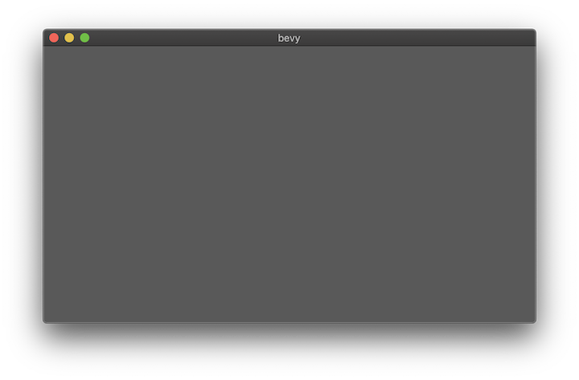
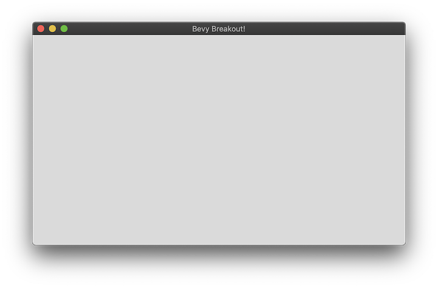

+++
title = "Setup"
weight = 1
sort_by = "weight"
template = "book-section.html"
page_template = "book-section.html"
+++

## Create a new Bevy Project

Our first step is to create a new Rust project. The easiest way to do this is with cargo, and then adding our dependencies.

```
cargo new breakout
cd breakout
```

Adding our dependencies to ```Cargo.toml```:

```toml
[package]
name = "breakout"
version = "0.1.0"
authors = ["YOUR NAME <you@veryrealemail.com>"]
edition = "2018"

[dependencies]
bevy = "0.2.1"
```

If we try to run the project now using ```cargo run``` we will download and compile all of the dependencies the project will use (since we're compiling all of our dependencies, the first time may take a while). Once the project has finished building we should see a very simple output:

```
Hello, world!
```

At this point, we are still showing the default "Hello World" application generated by cargo new. Let's go ahead and change that so we are building a window for our game.

### Building a Window

Lets open `src/main.rs`. Go ahead and replace everything listed here with the following:

```rs
use bevy::prelude::*;

fn main() {
    App::build()
        .add_default_plugins()
        .run();
}
```

The [plugins](learn/book/getting-started/plugins/) section of the [getting started](learn/book/getting-started/) section will help explain what the {{rust_type(type="trait" crate="bevy" name="AddDefaultPlugins" method="add_default_plugins" no_struct=true)}} method is doing on the {{rust_type(type="struct" crate="bevy_app" name="AppBuilder")}}. Primarily the default plugins are handling a lot of the boiler plate required to get started with the various libraries and features that bevy provides. This is everything from our EventLoop, and Timing systems; up to creating a window for your Desktop environment.

If everything has gone right, we should see a window on the screen that looks pretty similar to this:



Congratulations! While it does not seem like much at the moment, this brings you much closer to a full graphical game. Behind the scenes (slight pun intended), bevy has already done a lot of heavy lifting for us. 

Before we continue to the next chapter, let's make a couple of minor modifications to help make the project feel a little bit of our own.

### Setting the Window Title

While we're happy to be using the bevy framework, maybe it's not the title we want to be displayed for all of our games. Our first update will be to provide our Breakout title to the game window. Update our main function to look like this:

```rs
fn main() {
    App::build()
        .add_resource(WindowDescriptor{
            title: "Bevy Breakout!".to_string(),
            ..Default::default()
        })
        .add_default_plugins()
        .run();
}
```

The {{rust_type(type="struct" crate="bevy_window" name="WindowDescriptor")}} is a special resource to bevy. When added to our app, bevy's {{rust_type(type="struct" crate="bevy_window" name="WindowPlugin")}} will automatically search for this resource. If a WindowDescriptor is found it is used to configure the primary window.

WindowDescriptor enables us to set the window `title` as above, as well we can set the `height`, `width`, ability to resize, {{rust_type(type="enum", crate="bevy_window" name="WindowMode")}}, and `vsync`. At this time we are not worried about the other settings, so we use rust's struct update syntax to load the values for the remaining fields from the Default implementation of WindowDescriptor (as defined in the library).

It is important that the {{rust_type(type="struct" crate="bevy_window" name="WindowDescriptor")}} resource is added *before* we add the default plugins. This is because when the default plugins are added, they will also add the default WindowDescriptor if one is not already present.

### Setting the ClearColor

There is one other change we can make to our game so far, and that is to change the default background color. {{rust_type(type="struct" crate="bevy_render" mod="pass" name="ClearColor" no_mod=true)}} is another special resource to bevy that accepts a {{rust_type(type="struct" crate="bevy_render" mod="color" name="Color" no_mod=true)}} value which will be used as the default background color when clearing a view before painting.

Unlike the WindowDescriptor, the ClearColor can be added as a resource at any point. In order to keep things clear and logical however, we'll add it just prior to adding the WindowDescriptor resource. Our main function should now look like this:

```rs
fn main() {
    App::build()
        .add_resource(ClearColor(Color::rgb(0.7, 0.7, 0.7)))
        .add_resource(WindowDescriptor{
            title: "Bevy Breakout!".to_string(),
            ..Default::default()
        })
        .add_default_plugins()
        .run();
}
```


With these small changes, our game window should have a new title and background color being displayed.
